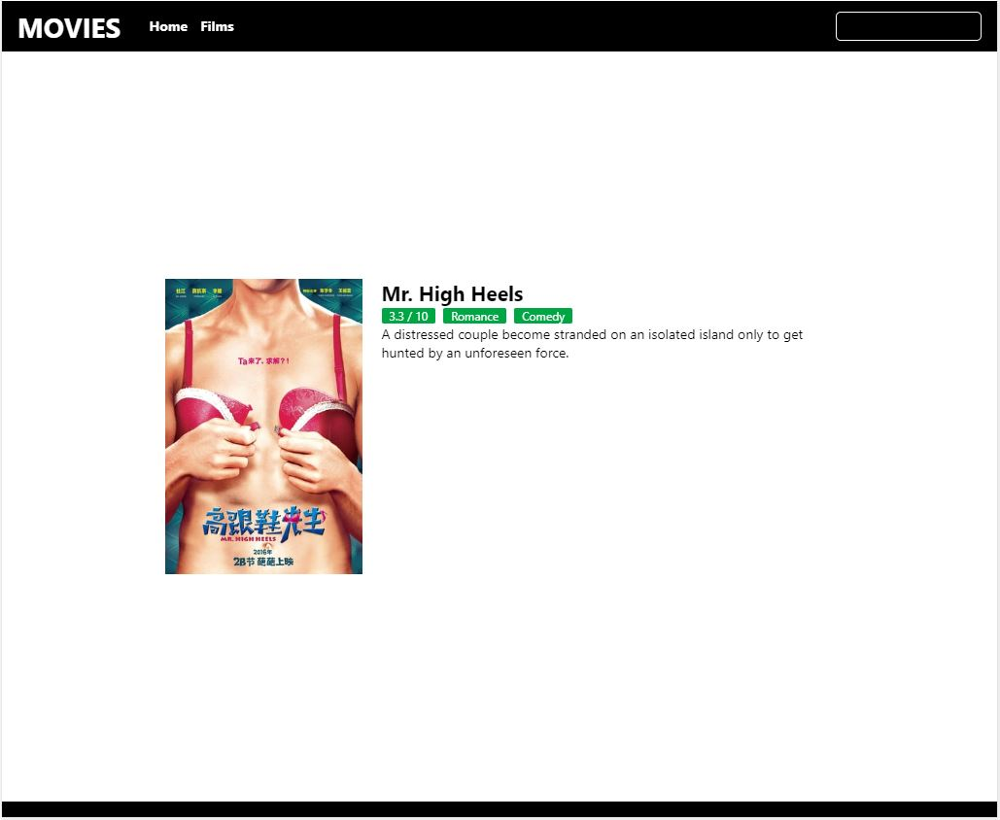
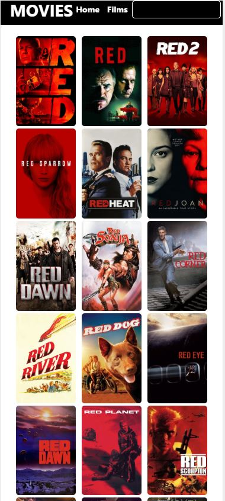
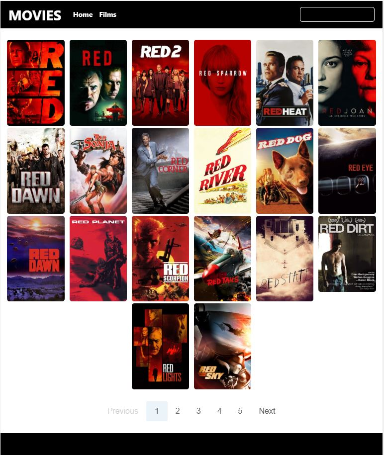
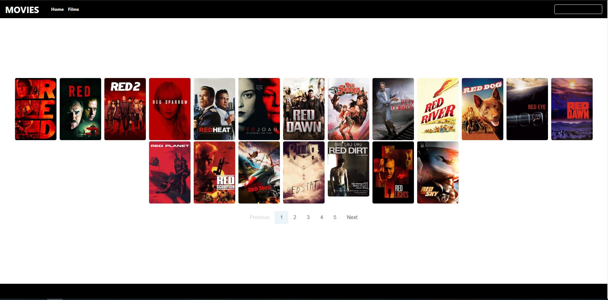
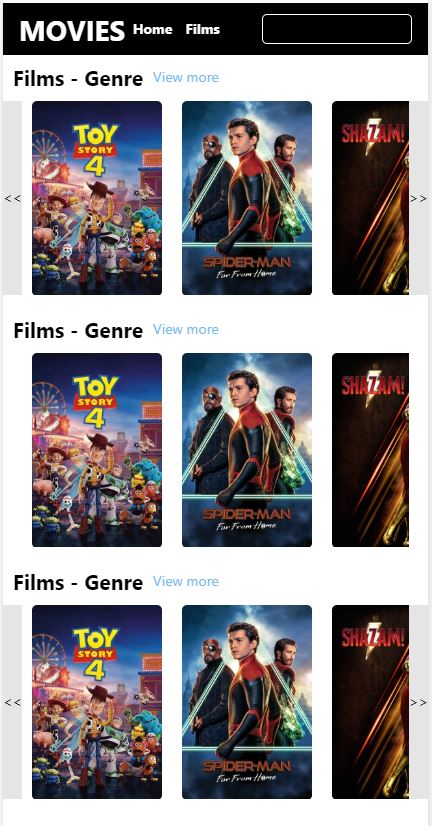
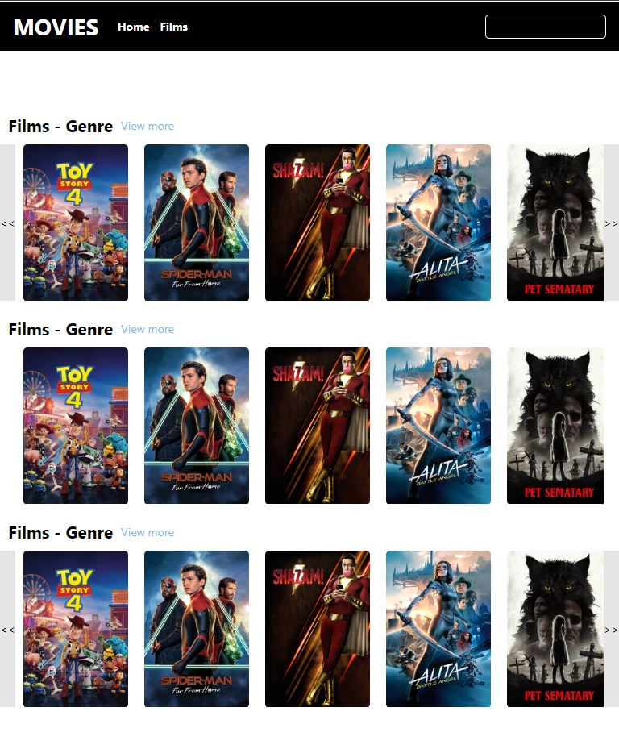
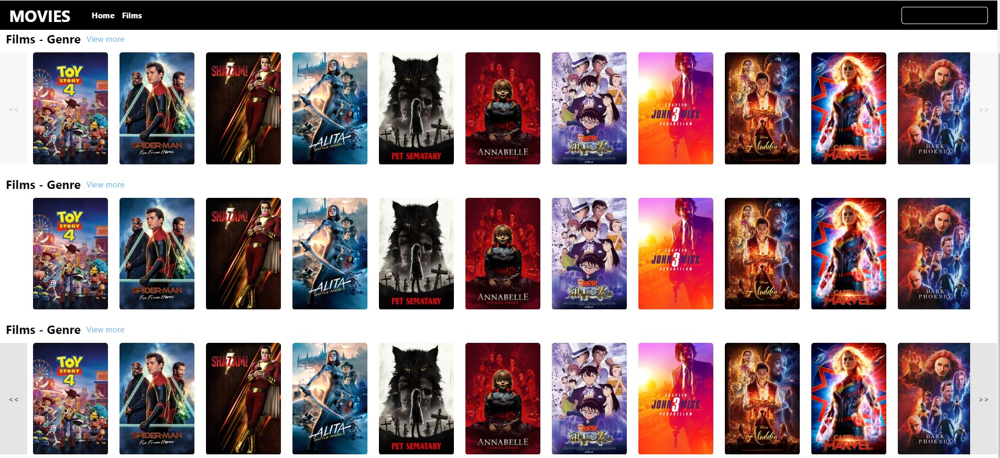

# Pet project (Adevinta)

To make this project I have been inspired with the pages like https://www.primevideo.com/ and https://www.netflix.com/.
This application allows the user to see current trends, search by name and see the movies in more detail once clicked on any one.

## Domain

TODO

## React components - Preview

### Detail
#### Mobile

#### Tablet

### Search List
#### Mobile

#### Tablet

#### Desktop

### Trendy List
#### Mobile

#### Tablet

#### Desktop

## Theme

TODO

## Web App

TODO
